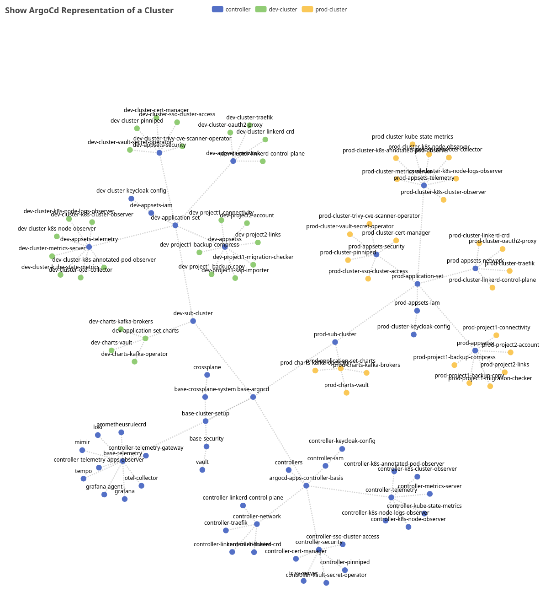
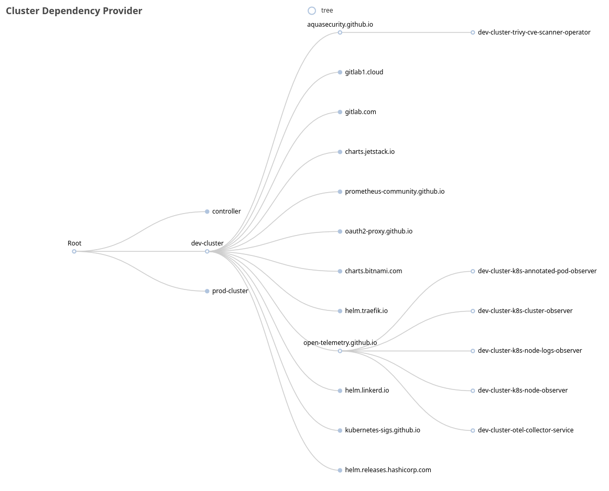

# argo-apps-viz kubectl

A small kubectl plugin that generates visual representations (using go-echarts) to document and illustrate ArgoCD concepts, such as the 'App of Apps' pattern across multiple clusters and dependency trees, primarily for documentation, learning, and teaching purposes.

## Examples




## Quick Start

```
kubectl krew install argo-apps-viz
kubectl argo-apps-viz
```